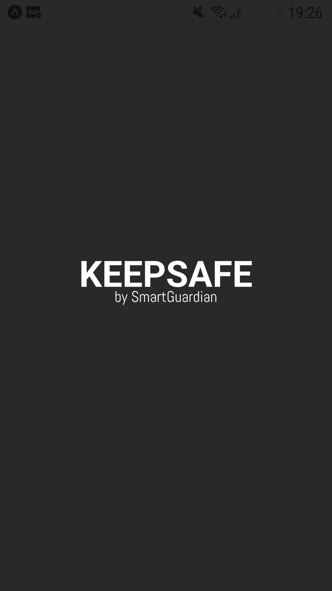
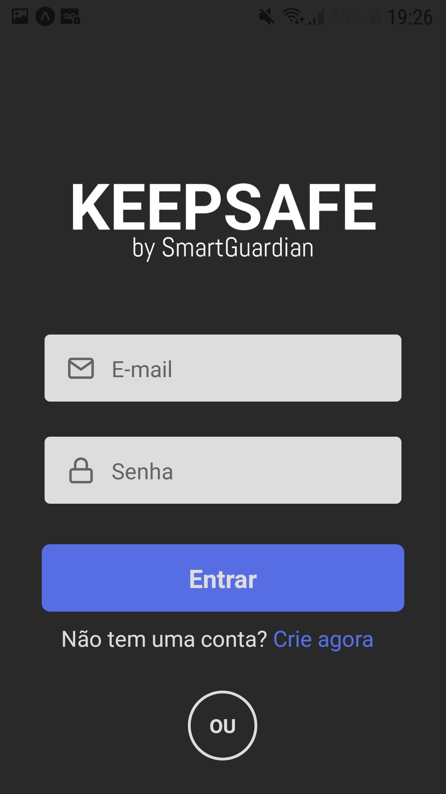
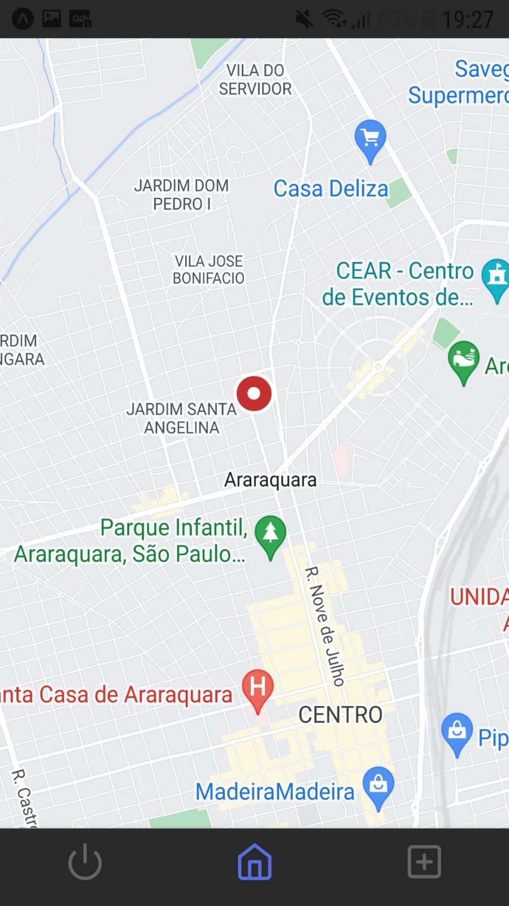
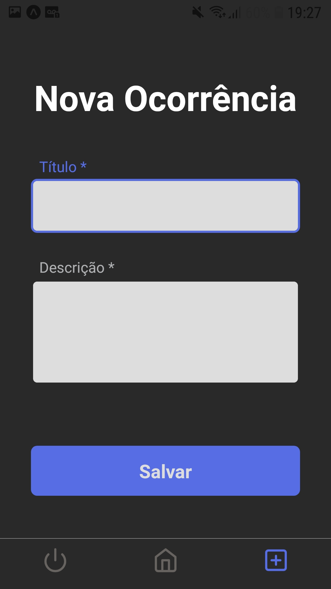
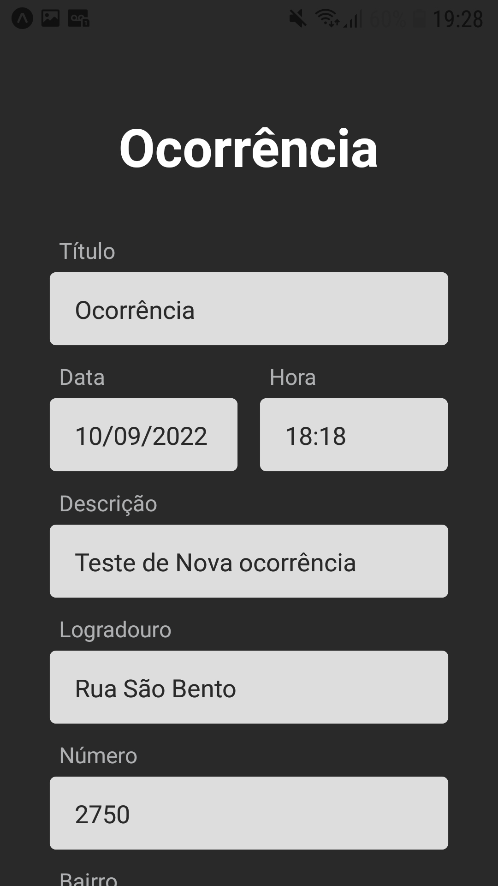

<div align="center">
  
</div>

<div align="center">
  <h1>KeepSafe</h1>
</div>

<div align="center">
  <p align="center" >
    <a href="#-sobre"> Sobre </a> |
    <a href="#-prévia"> Prévia </a> |
    <a href="#-tecnologias"> Tecnologias </a> |
    <a href="#-executar"> Executar </a> |
    <a href="#-licença"> Licença </a> 
  </p>
</div>

## 📚 Sobre

KeepSafe é um aplicativo que foi desenvolvido durante o segundo ano do curso de ADS da FIAP.

O aplicativo tem como objetivo facilitar aos usuários o acesso a dados de segurança e desastres naturais que tenham ocorrido nas proximidades.

## 💡 Prévia

<div align="center"> 
  

  

  

  

  
</div>

## 🚀 Tecnologias

As princiais tecnologias utilizadas:

- [React Native](https://reactnative.dev/)
- [Expo](https://docs.expo.dev/)
- [React Hook Form](https://react-hook-form.com/)
- [React Native Maps](https://github.com/react-native-maps/react-native-maps)
- [Firebase](https://firebase.google.com/)
- [Styled-Components](https://styled-components.com/)

## :zap: Executar

### Pré-requisitos

- [NodeJS LTS](https://nodejs.org/en/)

Instalar o Aplicativo Expo Go:

- [Android](https://play.google.com/store/apps/details?id=host.exp.exponent)
- [IOS](https://apps.apple.com/app/expo-go/id982107779)

### Recomendação

- [VS Code](https://code.visualstudio.com/download)
- [Yarn](https://classic.yarnpkg.com/en/docs/install#mac-stable)

#### Clone o projeto e acesse a pasta

```sh
$ git clone https://github.com/thudf/keep-safe-app.git
$ cd keep-safe-app
```

#### Configure as variáveis ambiente

```sh
$ cp .env.example .env
```

#### Iniciando a aplicação

```sh
# Instale as dependências
$ yarn
# ou
$ npm install

# Inicie a aplicação
$ npx expo start
```

### Abrindo o App no seu celular
- No seu Iphone, abra a câmera padrão e escaneie o QR Code que apareceu no terminal
- No seu dispositivo Android, abra o app Expo Go e pressione "Scan QR Code" na aba Home e escaneie o QR Code que apareceu no terminal

## 🖊 Licença

Este projeto é desenvolvido sob a licença MIT. Veja o arquivo [LICENSE](LICENSE) para saber mais detalhes.

---

<div align="center">
  
  <p><sup>By <b>SmartGuardian</b><sup></p>
</div>
